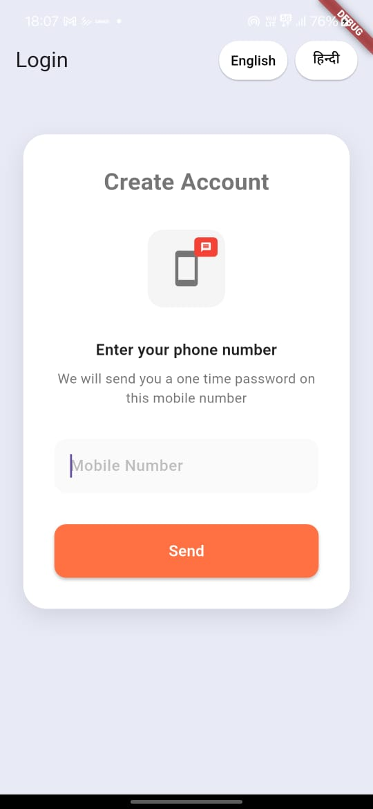
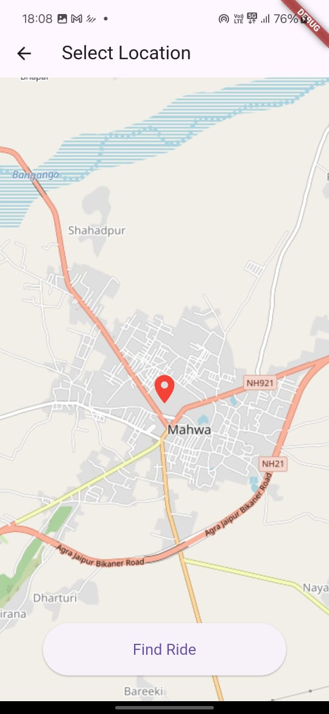
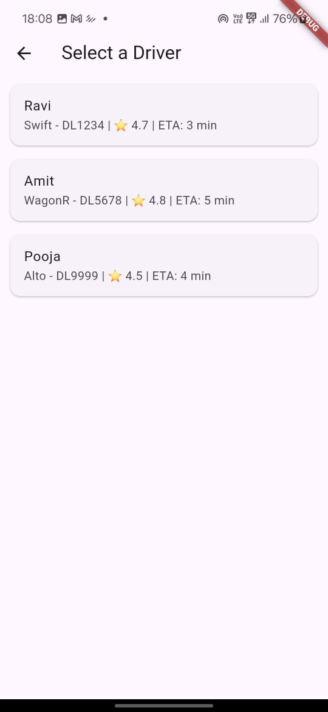
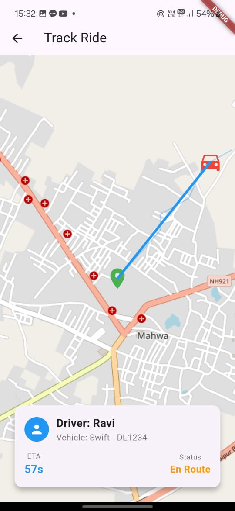

# RayRides DTU 🚗

A Flutter-based ride sharing prototype  with:
- Flutter Maps integration
- Driver selection
- Bilingual support (Hindi and English)

---

## 🚀 How to Run
1. Clone the repo
2. Run `flutter pub get`
3. Run `flutter run` (supports Android, Web, etc.)

---

## 🖥️ Screens
- Login screen
- Map with live location
- Ride tracking screen

---

## 🌟 Features
- User location permission
- Hindi/English localization
- Modular and scalable codebase

---

## 📸 Screenshots

## 📸 Screenshots

### 🔐 Login Screen

### 🗺️ Map Screen

### 🚗 Driver Selection Screen

### 📍 Ride Tracking Screen

